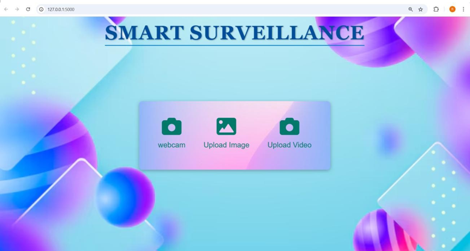

📌 Project Overview

This project is an AI-powered Smart Surveillance System that detects potential threats using YOLOv5 and triggers an alarm with real-time alerts. The system is designed to enhance security by identifying objects like weapons or unauthorized persons and notifying security personnel.

🚀 Features

Real-time Object Detection using YOLOv5

Live Video Stream Analysis

Alarm Activation on detecting threats

WhatsApp Notifications via Twilio API

Flask-based Web Interface for monitoring

🛠️ Tech Stack

Backend: Flask, OpenCV, Python

Deep Learning: YOLOv5 (PyTorch)

Frontend: HTML, CSS, JavaScript (Bootstrap)

Messaging API: Twilio API (WhatsApp Alerts)

Database (optional): PostgreSQL (for logs)

⚡ Installation & Setup

1️⃣ Clone the Repository

git clone https://github.com/SUSHMITHA0502-create/smart-surveillance.git
cd Object Detection main

2️⃣ Install Dependencies

pip install -r requirements.txt

3️⃣ Download the YOLOv5 Model

Since model files (.pt) are not included in the repo, download the pre-trained YOLOv5 model:

Download YOLOv5 Model

Place the model inside the yolov5 directory

4️⃣ Run the Application

python app.py

Visit: http://127.0.0.1:5000/

📸 Sample Output

(output/img2.png)

